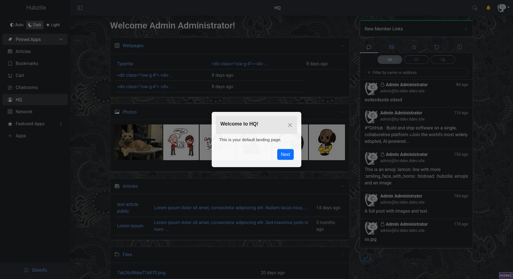
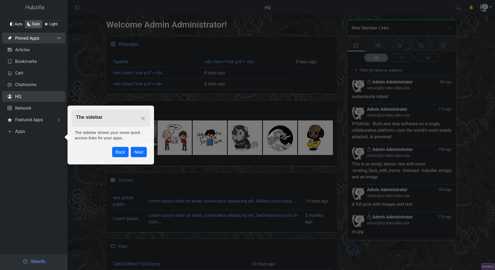

# Adminlte tour addon

This addon provides a guided tour to a new user introducing them to the interface and various elements. The addon once enabled by the admin is activated for anyone using the adminlte theme only. The tour can be cancelled and re-enabled from settings->display-settings section.

The default tour starts when a user visits /hq

## Screenshots

# Contributing language support
The tour steps are defined within a json file in `steps` folder as `<module>.<lang>.json`. To add a tour for a language (e.g. de), simply copy the `hq.en.json` as `hq.de.json` and replace the text fields with the traslated strings. 

# Todo
- Individual tours for various modules.
- Tours for accomplishing specific goals such as making a post, creating privacy group, installing/removing an addon, etc.

